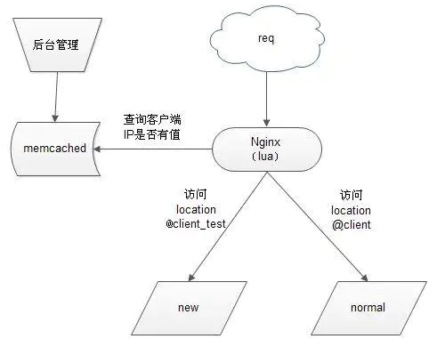

## nginx+lua+memcache 实现灰度发布

### 1.什么是灰度发布
让一部分用户继续用A系统，一部分用户开始用B系统。如果用户对B系统没有意见，那么逐步扩大范围。把所有用户迁移到B系统。在初始灰度发布的时候就可以发现，调整问题，以保证其影响度

可以通过以下图片了解发布发布流程



从上图可以看到：

* 当用户请求达到前端代理服务器nginx,内嵌的lua模块解析nginx 配置文件中的lua 脚本代码
* lua 变量获得客户端IP，去查询memacached 缓存内是否有该键值，如果有返回执行new 服务，否则则执行normal

### 2.安装配置过程
> 安装依赖包

```bash
yum -y install gcc gcc-c++ autoconf libjpeg libjpeg-devel libpng libpng-devel freetype freetype-devel libxml2 libxml2-devel zlib zlib-devel glibc glibc-devel glib2 glib2-devel bzip2 bzip2-devel ncurses ncurses-devel curl curl-devel e2fsprogs e2fsprogs-devel krb5 krb5-devel libidn libidn-devel openssl openssl-devel openldap openldap-devel nss_ldap openldap-clients openldap-servers make pcre-devel\
yum -y install gd gd2 gd-devel gd2-devel lua lua-devel
yum –y install memcached
```
> 下载lua 模块，lua-memcache操作库文件和nginx包

```bash
wget https://github.com/openresty/luajit2/archive/v2.1-20201229.tar.gz
wget https://github.com/simpl/ngx_devel_kit/archive/v0.2.18.tar.gz
wget https://github.com/chaoslawful/lua-nginx-module/archive/v0.8.5.tar.gz
wget https://github.com/agentzh/lua-resty-memcached/archive/v0.11.tar.gz
wget http://nginx.org/download/nginx-1.4.2.tar.gz

#安装luajit2
cd luajit2-2.1-20201229
make install PREFIX=/usr/local/luajit2

#解压编译安装
tar xvf nginx-1.4.2.tar.gz
cd nginx-1.4.2/
./configure \
--prefix=/soft/nginx/ \
--with-http_gzip_static_module \
--add-module=/root/ngx_devel_kit-0.2.18/ \
--add-module=/root/lua-nginx-module-0.8.5/

make&&make install
```

> 拷贝lua的memcached操作库文件


```bash
tar xvf v0.11.tar.gz

cp -r lua-resty-memcached-0.11/lib/resty/ /usr/lib64/lua/5.1/
```

>配置nginx

```bash
vim /soft/nginx/conf/nginx.conf

worker_processes  1;

events {
    worker_connections  1024;
}

http {
    include       mime.types;
    default_type  application/octet-stream;

    upstream client {
        server 10.11.4.62:81;
    }
    upstream client_test {
        server 10.11.4.62:82;
    }

    sendfile        on;

    keepalive_timeout  65;

    #gzip  on;
    server {
        listen       80;
        server_name  localhost;
        
        location @client{
            proxy_pass http://client;
        }

        location @client_test{
            proxy_pass http://client_test;
        }
        
        location / {
            # lua 脚本
            content_by_lua '
             package.path = package.path..";/home/pkg/lua+nginx/lua-resty-memcached-0.11/lib/resty/?.lua"

             local headers=ngx.req.get_headers()
             local ip=headers["X-REAL-IP"] or headers["X_FORWARDED_FOR"] or ngx.var.remote_addr or "0.0.0.0"

             local memcached = require "memcached"
             local memc, err = memcached:new()
             if not memc then
                 ngx.say("failed to instantiate memc: ", err)
                 return
             end

             local ok, err = memc:connect("10.11.4.39", 11211)
             if not ok then
                 ngx.say("failed to connect: ", err)
                 return
             end

             local res, flags, err = memc:get(ip)
             if err then
                 ngx.say("failed to get ip ", err)
                 return
             end

             if res == "1" then
                 ngx.exec("@client_test")
                 return
             end

             ngx.exec("@client")
            ';
            default_type 'text/html';
        }

        error_page   500 502 503 504  /50x.html;
        location = /50x.html {
            root   html;
        }
    }
}

```

> 检测配置文件

```bash
#/soft/nginx/sbin/nginx -t

nginx: the configuration file /soft/nginx/conf/nginx.conf syntax is ok

nginx: configuration file /soft/nginx/conf/nginx.conf test is successful
```

> 启动nginx

```bash
/soft/nginx/sbin/nginx
```

> 启动memcached 服务

```bash
memcached -u nobody -m 1024 -c 2048 -p 11211 –d
```

### 测试验证

>测试lua 模块是否运行正常

* 访问http://192.168.1.1/hello 如果显示hello,lua 表示安装成功
* 在这里另一台测试机 192.168.1.12 一个用80端口执行正常代码，一个用81执行灰度发布代码
* 在memcached中以你的客户机地址为key，value值为1 标识设置为灰度发布

ps：如果设置为1访问到81则访问灰度代码如果设置为0则访问正常代码。
